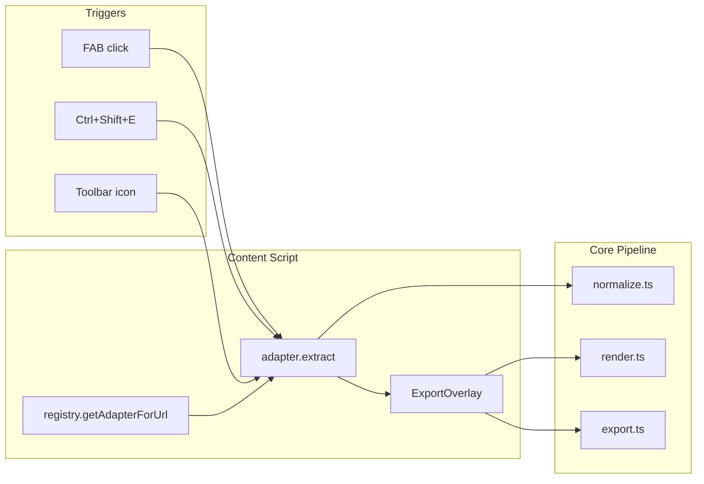
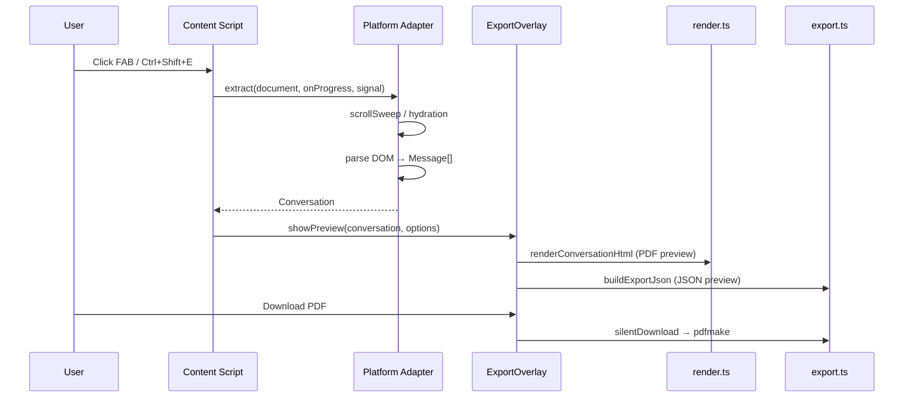

# ChatVault Export — Codebase Knowledge Document

> **Generated:** 2026-06-28  
> **Repo:** `chatvault-export` (product name: ChatVault Export)  
> **Purpose:** Self-contained brain dump for LLMs implementing features, fixing bugs, or refactoring safely.

---

## Table of Contents

1. [High-Level Overview](#1-high-level-overview)
2. [System Architecture](#2-system-architecture)
3. [Feature-by-Feature Analysis](#3-feature-by-feature-analysis)
4. [Things You Must Know Before Changing Code](#4-things-you-must-know-before-changing-code)
5. [Technical Reference & Glossary](#5-technical-reference--glossary)
6. [Inconsistencies & Gaps Audit](#6-inconsistencies--gaps-audit)
7. [File Index](#7-file-index)

---

## 1. High-Level Overview

### What the Application Is

**ChatVault Export** is a **Chrome Manifest V3 browser extension** built with **WXT** and **TypeScript**. It runs on 12 AI chat platforms, reads conversations from the live DOM, normalizes them into a shared schema, shows an in-page preview overlay, and exports **PDF** (via pdfmake) or **JSON** (copy to clipboard).

All processing is **local** — no backend, no database, no external API for chat content.

### Target Users

- Users who want to archive or share AI chat conversations as formatted documents
- Power users on ChatGPT, Claude, DeepSeek, Gemini, Grok, Perplexity, and six P1 platforms

### Main Features & Business Purpose

| Feature | Business Purpose | Primary Files |
|---------|------------------|---------------|
| Platform detection | Only activate on supported AI chat URLs | `src/core/registry.ts`, `src/adapters/*.ts` |
| DOM extraction | Capture full conversation including lazy-loaded turns | `src/adapters/base.ts`, platform adapters |
| Claude hydration | Recover truncated paste/artifact content not in static DOM | `src/adapters/claude-hydrate.ts`, `claude-extract.ts` |
| Preview overlay | Let user verify/correct export before download | `src/ui/overlay.ts` |
| Message selection | Export subset of turns | `src/ui/overlay.ts`, `src/core/adapter.ts` |
| PDF export | Professional A4 document for sharing/archival | `src/core/render.ts`, `src/core/export.ts` |
| JSON export | Machine-readable backup | `src/core/export.ts`, `src/ui/overlay.ts` |
| FAB + keyboard shortcut | Low-friction trigger from any supported page | `src/ui/fab.ts`, `src/entrypoints/background.ts` |
| Options persistence | Remember thinking toggle and filename template | `src/core/storage.ts` |

### Feature Interaction Map



---

## 2. System Architecture

### Tech Stack

| Layer | Technology |
|-------|------------|
| Extension framework | WXT 0.20 (Vite 7 under the hood) |
| Language | TypeScript 5.8 (strict, `noUnusedLocals`) |
| Manifest | MV3 |
| Markdown | `marked` + `marked-highlight` + `highlight.js` |
| HTML→MD | `turndown` |
| PDF | `html-to-pdfmake` + `pdfmake` (Roboto vfs fonts) |
| Tests | Vitest 3 + jsdom |
| Storage | `chrome.storage.local` via WXT global `browser` |

### Directory Structure

```
src/
├── entrypoints/
│   ├── background.ts          # Service worker: toolbar + keyboard shortcut
│   └── content/index.ts       # FAB + export orchestration
├── adapters/                  # 12 platform DOM extractors
│   ├── base.ts                # Shared factory (createBaseAdapter)
│   ├── claude.ts              # Claude orchestration
│   ├── claude-extract.ts      # Claude paste/artifact parsing
│   ├── claude-hydrate.ts      # Claude UI automation + fetch hook
│   └── *.ts                   # Per-platform configs
├── core/
│   ├── schema.ts              # Message, Conversation, ExportOptions
│   ├── adapter.ts             # PlatformAdapter interface, filter/dedupe
│   ├── registry.ts            # Adapter registration
│   ├── normalize.ts           # HTML→markdown, filenames
│   ├── extract-utils.ts       # Scroll, circuit breaker, DOM helpers
│   ├── attachments.ts         # Generic attachment extraction
│   ├── render.ts              # HTML document generation
│   ├── export.ts              # PDF + JSON export
│   ├── storage.ts             # chrome.storage.local
│   └── messages.ts            # Extension message type definitions
├── ui/
│   ├── overlay.ts             # Shadow DOM preview (806 lines)
│   ├── fab.ts                 # Floating action button
│   └── progress.ts            # Progress bar component
└── assets/
    └── print.css              # A4 print layout
```

### Data Flow



### Cross-Cutting Concerns

| Concern | Implementation |
|---------|----------------|
| **Security** | No external data transmission; host_permissions scoped to 12 domains |
| **Cancellation** | `AbortSignal` in overlay; `CircuitBreakerError` on abort/timeout |
| **Limits** | `MAX_TURNS=500`, `EXTRACTION_TIMEOUT_MS=90_000` in `schema.ts` |
| **Logging** | Minimal — errors surfaced via `alert()` in content script |
| **Auth** | None — relies on user's logged-in session on each platform |
| **Caching** | Claude `HydratedContentCache` in-memory during extraction only |

### Architectural Patterns

1. **Adapter pattern** — `PlatformAdapter` interface; most platforms use `createBaseAdapter()` factory
2. **Registry pattern** — `initAdapters()` registers all adapters at content script load
3. **Shadow DOM UI** — Overlay and FAB isolate styles from host page
4. **Lazy imports** — pdfmake, html-to-pdfmake loaded only on PDF download
5. **Circuit breaker** — `withCircuitBreaker()` wraps all extractions with timeout + abort

---

## 3. Feature-by-Feature Analysis

### 3.1 Export Trigger (FAB + Shortcut + Toolbar)

**Purpose:** Start export without leaving the chat page.

**Entry points:**
- `src/ui/fab.ts` — floating button (bottom-right, extension icon, glow animation)
- `src/entrypoints/background.ts` — `browser.action.onClicked` + `browser.commands.onCommand('export-chat')`
- Both send `{ type: 'TRIGGER_EXPORT' }` to content script

**Content handler:** `src/entrypoints/content/index.ts` → `startExport()`

**Edge cases:**
- If already exporting, `startExport()` returns early (`isExporting` guard)
- If URL unsupported, shows `alert()`
- Background catches sendMessage failure silently when content script not loaded

### 3.2 Platform Adapter Extraction

**Purpose:** Convert platform-specific DOM into normalized `Conversation`.

**Entry point:** `PlatformAdapter.extract(document, onProgress?, signal?)`

#### Base adapter pipeline (`src/adapters/base.ts`)

1. Optional `preExtract()` hook
2. Find container via selector fallback chain
3. `scrollSweep()` or `virtualScrollSweep()` (DeepSeek)
4. `queryAllMerged()` for message elements
5. `detectRole()` — selectors → `data-message-author-role` → aria-label → even/odd fallback
6. Clone content excluding buttons/chrome
7. `extractAttachmentsFromElement()` (skipped for Claude)
8. `dedupeMessages()` + `enforceTurnLimit()`
9. Build `Conversation` with metadata

#### ChatGPT (`src/adapters/chatgpt.ts`)

- Waits for streaming stop button to disappear before extraction
- Custom scroll sweep (600px steps, 400ms delay)
- Delegates parsing to base adapter

#### Claude (`src/adapters/claude.ts` + extract + hydrate)

**Most complex adapter (~1,573 lines across 3 files).**

Pipeline:
1. `scrollSweep` + expand paste buttons
2. `preExtractHydration()` — clicks every paste thumbnail and artifact card
3. `collectClaudeTurns()` — user `[data-testid="user-message"]` + `.font-claude-response`
4. Per turn: `buildClaudeUserTurnContent`, `extractClaudeUserPastes`, `extractClaudeAssistantCommentary`, `extractClaudeAssistantArtifacts`
5. Hydration uses: panel UI clicks, clipboard read, page-world fetch hook for `download-file`, Performance API URLs

**Hidden dependencies:** Requires `clipboardRead` permission; injects page-world script for fetch interception.

#### Perplexity (`src/adapters/perplexity.ts`)

- Custom `extract()` — does NOT use base message parsing
- Separate user (`div[class*="group/query"]`) and assistant (`div[id^="markdown-content-"]`) turn collection
- Merges and sorts by DOM order
- Strips disclaimer/citation elements

#### DeepSeek (`src/adapters/deepseek.ts`)

- `useVirtualScroll: true` — scrolls each message into view individually

#### Gemini (`src/adapters/gemini.ts`)

- `queryAllMerged` for both `user-query` and `model-response` tags

#### Thin adapters (Copilot, Poe, Kimi, Qwen, NotebookLM, AI Studio, Grok)

- Pure `createBaseAdapter()` configs with selector chains

### 3.3 Preview Overlay

**Purpose:** Let user review, select messages, toggle thinking, and export.

**File:** `src/ui/overlay.ts` (806 lines)

**Behavior:**
- Shadow DOM with focus trap; Esc cancels (ignores synthetic Escape from Claude hydration)
- Default preview mode: **JSON** (not PDF)
- Toggle to PDF preview (A4-width iframe)
- Sidebar: select all/none individual messages
- Checkbox: include thinking chains (saves to storage on change)
- Actions: Copy JSON, Download PDF, Cancel

**Callbacks:** `onDownload`, `onCancel`, `onClose` passed from content script

### 3.4 Rendering Pipeline

**File:** `src/core/render.ts`

1. `filterMessages()` — thinking toggle + selected IDs
2. Conversation title as inline `<h1>` header
3. Each message: markdown via `marked` + highlight.js (9 languages registered)
4. Attachments: paste before user body, artifacts after assistant body
5. Skips label-only artifacts and duplicate content
6. Inlines `print.css`; preview mode adds screen-only A4 padding
7. Loads Google Fonts + highlight.js CDN

**Note:** Message anchors (`id="msg-N"`) are rendered but **no TOC section** is generated.

### 3.5 PDF Export

**File:** `src/core/export.ts`

1. `buildExportDocument()` → `renderConversationHtml()`
2. `extractMainHtml()` — parses rendered HTML, extracts `<main.conversation>`
3. `htmlToPdfMakeContent()` — converts to pdfmake content tree
4. `downloadViaPdfMake()` — Roboto fonts from vfs, A4, page footer numbers
5. `silentDownload()` — entry point from overlay

**Unused:** `printViaIframe()` — hidden iframe + `window.print()` path exists but has no callers.

### 3.6 JSON Export

**File:** `src/core/export.ts` → `buildExportJson()`

Returns pretty-printed JSON with filtered messages and updated `messageCount`.

### 3.7 Options Storage

**File:** `src/core/storage.ts`

- Key: `chatvault_export_options` (from `messages.ts`)
- Schema: `ExportOptions` — `includeThinking`, `selectedMessageIds?`, `filenameTemplate?`
- Legacy `coverPage` field stripped on load

### 3.8 Extension Messaging (Partially Implemented)

**File:** `src/core/messages.ts`

Defines message types: `GET_STATUS`, `GET_DIAGNOSTICS`, `START_EXPORT`, `EXPORT_PROGRESS`, `CANCEL_EXPORT`, `GET_OPTIONS`, `SAVE_OPTIONS`, `TRIGGER_EXPORT`, etc.

**Actually wired:**
- Background: `START_EXPORT`, toolbar → `TRIGGER_EXPORT`
- Content: `TRIGGER_EXPORT` only

**Not wired:** Status, diagnostics, options sync, progress reporting to popup.

---

## 4. Things You Must Know Before Changing Code

### 4.1 Claude Hydration Is Fragile

- Simulates user clicks on paste thumbnails and artifact cards
- Reads side panels via DOM climbing heuristics (Copy button + body length thresholds)
- Uses `clipboardRead` and page-world fetch hook
- Synthetic Escape events are filtered in overlay to avoid accidental cancel
- **Do not refactor hydration without running `tests/unit/claude.test.ts` (25 tests)**

### 4.2 Scroll Sweep Is Required for Lazy DOM

Most platforms virtualize/lazy-load messages. `scrollSweep()` must complete before parsing or messages will be missing.

### 4.3 Selector Fallback Order Matters

New selectors must be added **earlier** in arrays (first match wins). Document changes in `docs/SELECTORS.md`.

### 4.4 Circuit Breaker Enforces Hard Limits

- 500 messages max (`MAX_TURNS`)
- 90 second timeout (`EXTRACTION_TIMEOUT_MS`)
- User cancel via AbortSignal

### 4.5 Attachment Extraction Is Platform-Split

- Claude: custom extraction in `claude-extract.ts` (base `attachments.ts` returns `[]` for `platform === 'claude'`)
- Others: generic paste/file detection in `attachments.ts`

### 4.6 PDF Fonts ≠ Preview Fonts

- Preview HTML uses Inter + JetBrains Mono (Google Fonts CDN)
- PDF uses Roboto (pdfmake bundled vfs)
- Visual mismatch between preview and final PDF is expected

### 4.7 Filename `{count}` Uses Unfiltered Count

`generateFilename()` in `export.ts` uses `conversation.messages.length`, not filtered message count.

### 4.8 Content Script URL Matches ≠ Host Permissions

Content script matches include URLs not in `host_permissions`:
- `https://kimi.com/*` — in content matches, NOT in host_permissions
- Qwen adapter matches `/qwen\.ai/` but manifest only has `chat.qwen.ai`

### 4.9 Popup Documented But Missing From Repo

`readme.md` describes popup options and diagnostics, but **`src/entrypoints/popup/` does not exist** in the committed codebase or on disk. Built manifest has no `default_popup`. Toolbar click triggers direct export via background, not a popup UI.

### 4.10 WXT Global `browser`

Uses WXT-provided global `browser` API. `webextension-polyfill` is in `package.json` but **never imported**.

---

## 5. Technical Reference & Glossary

### Glossary

| Term | Definition |
|------|------------|
| **Turn** | One user or assistant message in a conversation |
| **Hydration** | Claude-specific process of opening panels to read full paste/artifact content |
| **Scroll sweep** | Iterative scrolling to force lazy-loaded DOM nodes to render |
| **Virtual scroll sweep** | Per-element `scrollIntoView` for virtualized lists (DeepSeek) |
| **Circuit breaker** | Timeout + turn limit wrapper around extraction |
| **Attachment kinds** | `paste`, `file`, `artifact` — see `AttachmentKind` in `schema.ts` |
| **Thinking/reasoning** | Chain-of-thought blocks filtered by `includeThinking` option |

### Key Types (`src/core/schema.ts`)

```typescript
interface Message {
  id: string;
  role: 'user' | 'assistant' | 'system' | 'reasoning';
  content: string;
  html?: string;
  timestamp?: string;
  model?: string;
  isThinking?: boolean;
  attachments?: Attachment[];
}

interface Conversation {
  metadata: ConversationMetadata;
  messages: Message[];
}

interface ExportOptions {
  includeThinking: boolean;
  selectedMessageIds?: string[];
  filenameTemplate?: string;
}
```

### Key Functions

| Function | File | Purpose |
|----------|------|---------|
| `createBaseAdapter()` | `adapters/base.ts` | Factory for platform adapters |
| `initAdapters()` | `adapters/index.ts` | Register all 12 adapters |
| `getAdapterForUrl()` | `core/registry.ts` | URL → adapter lookup |
| `filterMessages()` | `core/adapter.ts` | Apply export options filters |
| `dedupeMessages()` | `core/adapter.ts` | Remove duplicate role+content pairs |
| `scrollSweep()` | `core/extract-utils.ts` | Lazy-load DOM via scrolling |
| `withCircuitBreaker()` | `core/extract-utils.ts` | Timeout + abort wrapper |
| `normalizeContent()` | `core/normalize.ts` | HTML→markdown via turndown |
| `renderConversationHtml()` | `core/render.ts` | Full HTML document |
| `silentDownload()` | `core/export.ts` | PDF download entry point |
| `buildExportJson()` | `core/export.ts` | JSON string for copy |
| `preExtractHydration()` | `adapters/claude-hydrate.ts` | Claude panel automation |
| `ExportOverlay.showPreview()` | `ui/overlay.ts` | Main preview UI |

### Platform Adapter Summary

| ID | File | Pattern | Lines | Special |
|----|------|---------|-------|---------|
| chatgpt | `chatgpt.ts` | Base + override | 60 | Streaming wait |
| claude | `claude.ts` + extract + hydrate | Fully custom | 1,573 | Hydration, clipboard, fetch hook |
| deepseek | `deepseek.ts` | Base | 22 | Virtual scroll |
| gemini | `gemini.ts` | Base | 32 | queryAllMerged |
| grok | `grok.ts` | Base | 19 | Matches grok.com + x.com |
| perplexity | `perplexity.ts` | Custom extract | 176 | Separate user/assistant turns |
| copilot | `copilot.ts` | Base | 20 | — |
| poe | `poe.ts` | Base | 19 | — |
| kimi | `kimi.ts` | Base | 19 | kimi.moonshot.cn + kimi.com |
| qwen | `qwen.ts` | Base | 19 | chat.qwen.ai + qwen.ai |
| notebooklm | `notebooklm.ts` | Base | 19 | — |
| aistudio | `aistudio.ts` | Base | 19 | — |

### Supported URL Patterns

**Content script matches** (`src/entrypoints/content/index.ts`):
All 12 platforms including `kimi.com` and `x.com`.

**Host permissions** (`wxt.config.ts`):
Same except **missing `kimi.com`** and **missing `qwen.ai`** (only `chat.qwen.ai`).

### Test Coverage

| File | Tests | Scope |
|------|-------|-------|
| `tests/unit/core.test.ts` | 36 | Schema, dedupe, normalize, render, export, attachments |
| `tests/unit/claude.test.ts` | 25 | Claude adapter + hydrate/extract; fixture `claude-vapi-german.html` |
| `tests/unit/perplexity.test.ts` | 1 | Role detection with `.prose` inner content |

**Run:** `npm test` (62 tests, all passing as of 2026-06-28)

### Build & Deploy

```bash
npm install
npm run dev      # WXT dev server with HMR
npm run build    # → .output/chrome-mv3/
npm run zip      # Packaged extension
npm test         # Vitest
```

Load unpacked: `chrome://extensions` → `.output/chrome-mv3/`

### External APIs / CDN (Preview Only)

- `fonts.googleapis.com` — Inter, JetBrains Mono
- `cdnjs.cloudflare.com/ajax/libs/highlight.js/11.11.1/styles/github.min.css`

---

## 6. Inconsistencies & Gaps Audit

> **No code was changed during this audit.** These are findings for future fixes.

### 6.1 Critical / Functional

| # | Issue | Evidence | Impact |
|---|-------|----------|--------|
| C1 | **Popup missing from repo** | `readme.md` documents popup; `src/entrypoints/popup/` absent from git and disk; build output has no popup bundle | Options UI, diagnostics, filename template editing unavailable |
| C2 | **Message handlers incomplete** | `messages.ts` defines `GET_STATUS`, `GET_DIAGNOSTICS`, etc.; `content/index.ts` only handles `TRIGGER_EXPORT` | Even if popup existed, status/diagnostics would fail |
| C3 | **TOC documented but not implemented** | `readme.md` L104: "TOC – auto-generated when >10 messages"; `render.ts` has no TOC; `core.test.ts` L273 asserts no TOC | User expectation mismatch |
| C4 | **Host permission gaps** | Content matches `kimi.com`; `wxt.config.ts` host_permissions omit it. Qwen adapter matches `qwen.ai`; manifest only `chat.qwen.ai` | Possible permission errors on those domains |
| C5 | **Toolbar has no popup** | `wxt.config.ts` action has `default_title` only, no `default_popup`; `background.ts` uses `onClicked` | Toolbar click triggers export directly, contradicting readme popup docs |

### 6.2 Documentation vs Code

| Doc Claim | Actual Code |
|-----------|-------------|
| README workflow "Print" path (`printViaIframe`) | `printViaIframe` exported in `export.ts` L55, **zero callers**; overlay has no Print button |
| README "Table of contents" option in popup | Popup doesn't exist; `ExportOptions` has no `tableOfContents` field |
| README tests: "schema, deduplication, filename, slugify, turndown" | Also covers render, pdfmake, attachments, Claude (25 tests), Perplexity (1 test) |
| `docs/SELECTORS.md` Perplexity selectors | Docs: `[data-testid="user-message"]`; code: `div[class*="group/query"]` + `div[id^="markdown-content-"]` |
| `docs/SELECTORS.md` Claude grouping | Docs mention `[data-test-render-count]`; code primarily uses `[data-testid="user-message"]` + `.font-claude-response` |
| `docs/PRIVACY.md` "print engine or pdfmake" | Only pdfmake download path used in UI |
| `readme.md` architecture lists `popup/` | Directory not present in repo |

### 6.3 Dead / Unused Code

| Symbol | Location | Notes |
|--------|----------|-------|
| `printViaIframe()` | `src/core/export.ts` | No callers |
| `removeFab()` | `src/ui/fab.ts` | Exported, never used |
| `AdapterContext` | `src/core/adapter.ts` | Interface defined, never used |
| Message types | `src/core/messages.ts` | `EXPORT_PROGRESS`, `CANCEL_EXPORT`, `GET_OPTIONS`, `OPTIONS_RESPONSE`, `SAVE_OPTIONS`, `STATUS_RESPONSE` — not wired |
| `webextension-polyfill` | `package.json` | Dependency never imported |
| `coverPage` | `src/core/storage.ts` | Legacy field stripped on load only |

### 6.4 Duplicate Logic

| Logic | Locations |
|-------|-----------|
| `escapeHtml()` | `src/core/render.ts`, `src/ui/overlay.ts` |
| `isPasteLabelOnly()` | `src/core/render.ts`, `src/adapters/claude-extract.ts` |
| `extractArtifactTitle()` / `extractArtifactTitleFromCard()` | `claude-extract.ts`, `claude-hydrate.ts` (near-identical) |
| Turn merging pattern | `perplexity.ts` custom collect vs `queryAllMerged()` in `extract-utils.ts` |

### 6.5 Naming / Pattern Inconsistencies

| Item | Detail |
|------|--------|
| README filename | `readme.md` (lowercase) vs conventional `README.md` |
| Package vs product | npm `chatvault-export` vs manifest "ChatVault Export" |
| Options UI split | Overlay exposes thinking toggle; filename template documented in readme popup (missing) |
| Perplexity URL | Manifest: `www.perplexity.ai`; adapter regex `/perplexity\.ai/` is broader |
| Grok on x.com | `/x\.com/i` matches all X/Twitter pages where content script injects |
| Claude complexity | Only platform with 3 files + UI automation; others use factory |
| Test imports | Vitest config has `@` alias; tests use relative imports |
| `scripts/generate-icons.mjs` | Exists but not wired to npm scripts |

### 6.6 Type / Schema Gaps

- `ExportOptions` lacks `tableOfContents` (referenced in stale popup index if it existed)
- `generateFilename()` `{count}` uses unfiltered message count
- Built manifest content_scripts matches sorted alphabetically (WXT behavior) — functionally fine

---

## 7. File Index

### Priority File Map

```
(#) PRIORITY | PATH                              | TYPE   | LINES | NOTES
1   HIGH     | src/entrypoints/content/index.ts  | entry  | 92    | Main orchestration
2   HIGH     | src/ui/overlay.ts                 | ui     | 806   | Preview overlay
3   HIGH     | src/adapters/base.ts              | adapter| 176   | Factory pattern
4   HIGH     | src/adapters/claude-hydrate.ts    | adapter| 912   | Claude UI automation
5   HIGH     | src/adapters/claude-extract.ts    | adapter| 447   | Claude parsing
6   HIGH     | src/adapters/claude.ts            | adapter| 214   | Claude orchestration
7   HIGH     | src/core/render.ts                | core   | 156   | HTML generation
8   HIGH     | src/core/export.ts                | core   | 173   | PDF/JSON export
9   HIGH     | src/core/extract-utils.ts         | core   | 225   | Scroll, circuit breaker
10  HIGH     | src/core/normalize.ts             | core   | 173   | HTML→MD, filenames
11  MED      | src/adapters/perplexity.ts        | adapter| 176   | Custom extraction
12  MED      | src/adapters/chatgpt.ts           | adapter| 60    | Streaming wait
13  MED      | src/entrypoints/background.ts     | entry  | 35    | Shortcut routing
14  MED      | src/core/schema.ts                | core   | 46    | Type definitions
15  MED      | src/core/adapter.ts               | core   | 68    | Interface + filters
16  MED      | src/core/messages.ts              | core   | 49    | Message types (partial)
17  MED      | src/ui/fab.ts                     | ui     | 102   | FAB component
18  MED      | src/assets/print.css              | asset  | 228   | A4 layout
19  LOW      | src/adapters/*.ts (thin)          | adapter| ~19   | Factory configs
20  LOW      | wxt.config.ts                     | config | 45    | Manifest
21  LOW      | tests/unit/*.test.ts              | test   | 1,211 | 62 tests total
22  LOW      | docs/SELECTORS.md                 | docs   | 83    | Selector reference
23  LOW      | readme.md                         | docs   | 171   | Main docs (some stale)
```

---

## STATE BLOCK (Final)

```
INDEX_VERSION: 2026-06-28-v1
FILE_MAP_SUMMARY: 34 source files, 3 test files, 2 doc files, ~6,500 LOC
OPEN_QUESTIONS:
  - Was popup intentionally removed or never committed?
  - Should kimi.com / qwen.ai be added to host_permissions?
  - Should TOC and print paths be implemented or docs updated?
KNOWN_RISKS:
  - Claude hydration breaks on DOM changes
  - 10/12 adapters untested
  - URL permission mismatches
  - Popup/docs drift
GLOSSARY_DELTA: (see Section 5)
ASSUMPTIONS:
  - Popup source existed previously but was removed | confidence: medium
  - Toolbar direct-export is intentional interim UX | confidence: low
```

---

## Decisions / Findings

1. Architecture is clean and layered; Claude is the outlier requiring special handling.
2. Core export pipeline (extract → normalize → render → pdfmake) is solid and well-tested for core + Claude.
3. Major doc/code drift around popup, TOC, and print features.
4. Extension is functional for FAB + keyboard + toolbar export on supported pages.

## Next Steps (Recommended, Not Done)

1. Either restore popup entrypoint or remove popup references from readme.
2. Wire `GET_STATUS` / `GET_DIAGNOSTICS` in content script if popup restored.
3. Align `host_permissions` with content script matches and adapter URL patterns.
4. Implement TOC or remove from docs/tests expectations.
5. Remove or wire dead code (`printViaIframe`, `removeFab`, unused message types).
6. Add adapter tests for remaining 10 platforms.
7. Remove unused `webextension-polyfill` dependency.

---

*End of CODEBASE_KNOWLEDGE.md*
