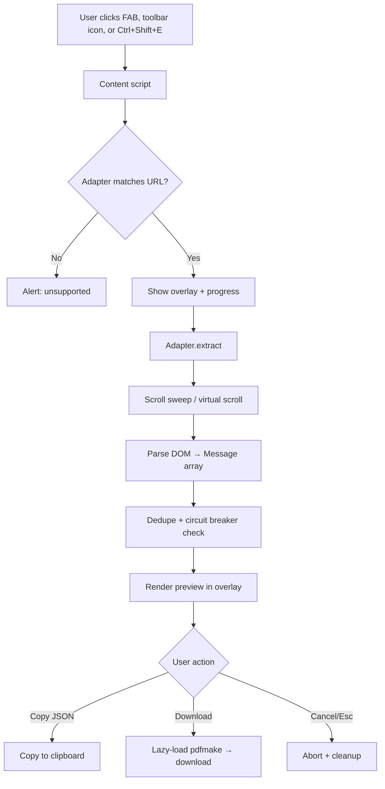

# ChatVault Export

Export AI chat conversations from **12 platforms** to beautifully formatted PDF documents — including pasted content, generated documents/artifacts, thinking chains, and **images** — in a single click. Built with **WXT**, **TypeScript**, and **Manifest V3**.

## How extraction works (v2)

ChatVault is **API-first with a DOM fallback**:

1. **API source** (Claude, ChatGPT): the extension reads the same conversation JSON
   the platform's own web app loads, using your logged-in session — same-origin,
   read-only GET requests. This captures the *exact* conversation: full pasted text,
   artifacts, thinking blocks, and image references, with no scraping fragility.
2. **DOM source** (all platforms): if the API is unavailable (logged out, shape
   change, unsupported page), the extension scrolls the chat to force lazy messages
   into the DOM and parses them with per-platform selector chains.

The preview overlay shows which source was used (`API` or `Page` badge).
Images are fetched with your session, re-encoded to PNG/JPEG, and embedded in both
the preview and the PDF.

## Supported Platforms

| Priority | Platform | Domain |
|----------|----------|--------|
| P0 | ChatGPT | chatgpt.com, chat.openai.com |
| P0 | Claude | claude.ai |
| P0 | DeepSeek | chat.deepseek.com |
| P0 | Gemini | gemini.google.com |
| P0 | Grok | grok.com, x.com |
| P0 | Perplexity | perplexity.ai |
| P1 | Copilot | copilot.microsoft.com |
| P1 | Poe | poe.com |
| P1 | Kimi | kimi.moonshot.cn, kimi.com |
| P1 | Qwen | chat.qwen.ai, qwen.ai |
| P1 | NotebookLM | notebooklm.google.com |
| P1 | Google AI Studio | aistudio.google.com |

## Quick Start

```bash
npm install
npm run dev      # development with hot reload
npm run build    # production build → .output/chrome-mv3/
npm test         # run unit tests
```

Load the extension in Chrome: `chrome://extensions` → Developer mode → Load unpacked → select `.output/chrome-mv3/`.

## Usage

1. Open a supported AI chat page
2. Click the floating **Export** button (bottom-right), press **Ctrl+Shift+E**, or click the toolbar icon
3. Wait for extraction (scroll sweep loads lazy messages)
4. Preview the conversation in the overlay (JSON or PDF view)
5. **Copy JSON** or **Download PDF**

## Architecture

```
src/
├── entrypoints/
│   ├── background.ts          # Service worker: toolbar/shortcut routing + image fetch relay
│   └── content/               # Content script: FAB + export orchestration
├── sources/                   # API-first extraction (primary path)
│   ├── claude-api.ts          # claude.ai conversation JSON → Conversation
│   └── chatgpt-api.ts         # chatgpt.com backend-api mapping tree → Conversation
├── adapters/                  # Platform-specific DOM extractors (fallback path)
│   ├── base.ts                # Shared adapter factory
│   └── *.ts                   # Per-platform selector configs
├── core/
│   ├── schema.ts              # Conversation, Message & Attachment types
│   ├── adapter.ts             # Adapter interface, filter, adjacent dedupe
│   ├── registry.ts            # Adapter registration & lookup
│   ├── normalize.ts           # HTML→markdown, filename helpers
│   ├── extract-utils.ts       # Scroll sweep, scrollable-container detection, circuit breaker
│   ├── images.ts              # Image fetch → PNG/JPEG data URL pipeline
│   ├── html-utils.ts          # Shared HTML escaping
│   ├── render.ts              # HTML renderer (marked + highlight.js)
│   ├── export.ts              # pdfmake PDF + JSON export
│   ├── storage.ts             # chrome.storage.local for options
│   └── messages.ts            # Extension message types
├── ui/
│   ├── overlay.ts             # Shadow DOM preview + error panel (focus trap, Esc)
│   ├── fab.ts                 # Floating action button
│   └── progress.ts            # Progress bar component
└── assets/
    └── print.css              # A4 print layout stylesheet
```

## Workflow



### Extraction Pipeline

1. **Detect platform** – `registry.getAdapterForUrl()` matches URL against adapter patterns
2. **API attempt** (Claude, ChatGPT) – fetch the conversation JSON with the user's session; exact content, no scraping
3. **Wait for streaming** (ChatGPT) – polls for stop-button before extraction
4. **Scroll sweep** (DOM fallback) – holds the scrollable container at the top to load older
   virtualized turns, then steps down for lazy content
5. **Virtual scroll sweep** (DeepSeek) – scrolls each message into view individually
6. **Parse messages** – fallback selector chains find role + content per turn
7. **Images** – content images fetched (content script → background relay for CORS)
   and re-encoded to PNG/JPEG data URLs, capped at 1400px / 40 images
8. **Normalize** – HTML content converted to markdown via turndown
9. **Dedupe** – removes back-to-back duplicates only (repeated turns are preserved)
10. **Circuit breaker** – enforces 500 message max and 90s timeout

### Rendering Pipeline

1. **Filter** – apply thinking toggle and optional message selection
2. **Conversation title** – thread name as inline header on page 1
3. **Messages** – markdown rendered via marked with syntax highlighting
4. **Print CSS** – inlined A4 layout with role colors and page numbers

### PDF Export

| Path | Method |
|------|--------|
| Download | Rendered HTML converted to pdfmake (matches preview formatting) |

## PDF Layout

- **Page size:** A4
- **Fonts:** Inter (body), JetBrains Mono (code) in preview; Roboto in PDF download
- **User messages:** Indigo accent `#4F46E5`
- **Assistant messages:** Emerald accent `#059669`
- **Reasoning/thinking:** Gray italic
- **Code blocks:** `#f4f4f8` background with highlight.js syntax colors
- **Footer:** Page numbers

## Configuration (Overlay)

| Option | Default | Description |
|--------|---------|-------------|
| Include thinking chains | ✓ | Export reasoning/thinking blocks (toggle in overlay) |
| Message selection | All | Select individual turns in overlay sidebar |
| Filename template | `ChatVault_{title}` | Stored in `chrome.storage.local`; variables: `{platform}`, `{title}`, `{date}`, `{model}`, `{count}` |

## Circuit Breaker

- **Max messages:** 500 turns
- **Timeout:** 90 seconds
- **Cancellation:** Esc key or Cancel button aborts via AbortSignal

## Selector Diagnostics

Platform adapters expose `getSelectorDiagnostics()` for development verification. See [docs/SELECTORS.md](docs/SELECTORS.md) for full selector reference.

## Privacy

All processing is local. No data leaves your browser. See [docs/PRIVACY.md](docs/PRIVACY.md).

## Testing

```bash
npm test
```

Test suites (110 tests total):

- **core.test.ts** (36) – schema, dedupe, normalize, render, export, attachments
- **claude.test.ts** (27) – Claude DOM adapter, hydration, paste/artifact extraction
- **claude-api.test.ts** (11) – Claude API payload mapping (pastes, artifacts, thinking, images)
- **chatgpt-api.test.ts** (10) – ChatGPT mapping-tree walk, branches, thoughts, image parts
- **images.test.ts** (11) – image collection, hydration fallbacks, render/JSON embedding
- **gemini.test.ts** (4) – Gemini DOM extraction, thought stripping, image capture
- **extract-utils.test.ts** (9) – scrollable-container detection, adjacent dedupe, filename count
- **claude-wiggle.test.ts** (2) – artifact output path matching
- **perplexity.test.ts** (1) – Perplexity role detection

## Development

### Adding a New Platform

1. Create `src/adapters/myplatform.ts` using `createBaseAdapter()`
2. Define fallback selector chains
3. Register in `src/adapters/index.ts`
4. Add URL to content script matches and manifest host_permissions in `wxt.config.ts`
5. Document selectors in `docs/SELECTORS.md`

### Updating Selectors

When a platform changes its DOM, add new selectors **earlier** in the fallback array. Use adapter `getSelectorDiagnostics()` to verify matches.

## License

MIT
