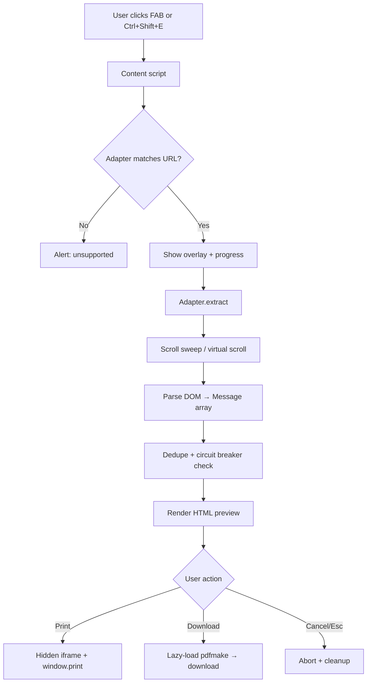

# ChatVault Export

Export AI chat conversations from **12 platforms** to beautifully formatted PDF documents. Built with **WXT**, **TypeScript**, and **Manifest V3**.

## Supported Platforms

| Priority | Platform | Domain |
|----------|----------|--------|
| P0 | ChatGPT | chatgpt.com, chat.openai.com |
| P0 | Claude | claude.ai |
| P0 | DeepSeek | chat.deepseek.com |
| P0 | Gemini | gemini.google.com |
| P0 | Grok | grok.com, x.com |
| P0 | Perplexity | perplexity.ai |
| P1 | Copilot | copilot.microsoft.com |
| P1 | Poe | poe.com |
| P1 | Kimi | kimi.moonshot.cn, kimi.com |
| P1 | Qwen | chat.qwen.ai |
| P1 | NotebookLM | notebooklm.google.com |
| P1 | Google AI Studio | aistudio.google.com |

## Quick Start

```bash
npm install
npm run dev      # development with hot reload
npm run build    # production build → .output/chrome-mv3/
npm test         # run unit tests
```

Load the extension in Chrome: `chrome://extensions` → Developer mode → Load unpacked → select `.output/chrome-mv3/`.

## Usage

1. Open a supported AI chat page
2. Click the floating **Export** button (bottom-right) or press **Ctrl+Shift+E**
3. Wait for extraction (scroll sweep loads lazy messages)
4. Preview the formatted document in the overlay
5. **Print / Save PDF** (primary) or **Download PDF** (silent pdfmake download)

## Architecture

```
src/
├── entrypoints/
│   ├── background.ts          # Service worker: keyboard shortcut routing
│   ├── popup/                 # Extension popup (options + diagnostics)
│   └── content/               # Content script: FAB + export orchestration
├── adapters/                  # Platform-specific DOM extractors (12 total)
│   ├── base.ts                # Shared adapter factory
│   └── *.ts                   # Per-platform selector configs
├── core/
│   ├── schema.ts              # Conversation & Message types
│   ├── adapter.ts             # Adapter interface, filter, dedupe
│   ├── registry.ts            # Adapter registration & lookup
│   ├── normalize.ts           # HTML→markdown, filename helpers
│   ├── extract-utils.ts       # Scroll sweep, circuit breaker, timeouts
│   ├── render.ts              # HTML renderer (marked + highlight.js)
│   ├── export.ts              # Print iframe + pdfmake download
│   ├── storage.ts             # chrome.storage.local for options
│   └── messages.ts            # Extension message types
├── ui/
│   ├── overlay.ts             # Shadow DOM preview (focus trap, Esc)
│   ├── fab.ts                 # Floating action button
│   └── progress.ts            # Progress bar component
└── assets/
    └── print.css              # A4 print layout stylesheet
```

## Workflow



### Extraction Pipeline

1. **Detect platform** – `registry.getAdapterForUrl()` matches URL against adapter patterns
2. **Wait for streaming** (ChatGPT) – polls for stop-button before extraction
3. **Scroll sweep** – scrolls chat container to force lazy-loaded messages into DOM
4. **Virtual scroll sweep** (DeepSeek) – scrolls each message into view individually
5. **Parse messages** – fallback selector chains find role + content per turn
6. **Normalize** – HTML content converted to markdown via turndown
7. **Dedupe** – removes duplicate role+content pairs
8. **Circuit breaker** – enforces 500 message max and 90s timeout

### Rendering Pipeline

1. **Filter** – apply thinking toggle and optional message selection
2. **Conversation title** – thread name as inline header on page 1
3. **TOC** – auto-generated when >10 messages
4. **Messages** – markdown rendered via marked with syntax highlighting
5. **Print CSS** – inlined A4 layout with role colors and page numbers

### PDF Export Paths

| Path | Method | When to use |
|------|--------|-------------|
| Primary | Hidden iframe + `window.print()` | Best fidelity, user picks "Save as PDF" |
| Secondary | Lazy-loaded pdfmake | Silent download without print dialog |

## PDF Layout

- **Page size:** A4
- **Fonts:** Inter (body), JetBrains Mono (code)
- **User messages:** Indigo accent `#4F46E5`
- **Assistant messages:** Emerald accent `#059669`
- **Reasoning/thinking:** Gray italic
- **Code blocks:** `#f4f4f8` background with highlight.js syntax colors
- **Footer:** Page numbers

## Configuration (Popup)

| Option | Default | Description |
|--------|---------|-------------|
| Include thinking chains | ✓ | Export reasoning/thinking blocks |
| Table of contents | ✓ | Auto TOC when >10 messages |
| Filename template | `ChatVault_{title}` | Variables: `{platform}`, `{title}`, `{date}`, `{model}`, `{count}` |

## Circuit Breaker

- **Max messages:** 500 turns
- **Timeout:** 90 seconds
- **Cancellation:** Esc key or Cancel button aborts via AbortSignal

## Selector Diagnostics

The popup shows live selector match status for the current page. See [docs/SELECTORS.md](docs/SELECTORS.md) for full selector reference.

## Privacy

All processing is local. No data leaves your browser. See [docs/PRIVACY.md](docs/PRIVACY.md).

## Testing

```bash
npm test
```

Tests cover: schema types, message deduplication, filename templates, slugify, and turndown HTML→markdown conversion.

## Development

### Adding a New Platform

1. Create `src/adapters/myplatform.ts` using `createBaseAdapter()`
2. Define fallback selector chains
3. Register in `src/adapters/index.ts`
4. Add URL to content script matches and manifest host_permissions
5. Document selectors in `docs/SELECTORS.md`

### Updating Selectors

When a platform changes its DOM, add new selectors **earlier** in the fallback array. Use popup diagnostics to verify matches.

## License

MIT
